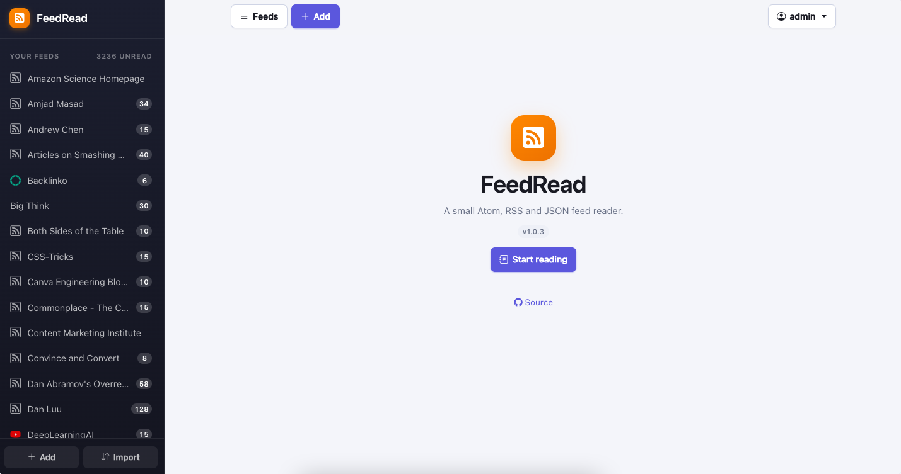
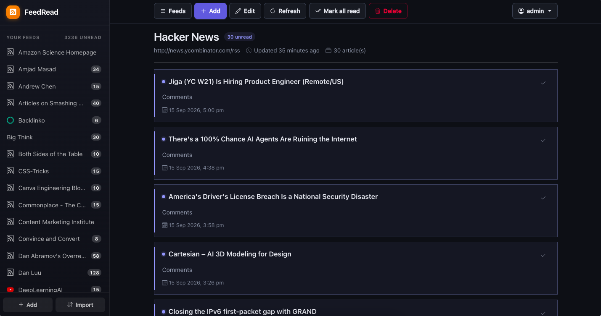

# FeedRead
Simple Atom/RSS reader




## Run

```sh
# Copy env file
cp .env.example .env

# Create the sqlite database file
touch database/database.sqlite

# Install Laravel dependencies
composer install

# Install nodejs dependencies
npm install

# Build assets
npm run build

# Generate key
php artisan key:generate

# Migrate and create the first administrator
php artisan migrate --seed

# Serve
php artisan serve

# In a second terminal: fetch articles in the background
php artisan schedule:work
```

The seeder prints the administrator password once. Note it down, then sign in and
change it, or create the first account yourself instead of seeding:

```sh
php artisan feedread:user you@example.com --name="Your name" --admin
```

`php artisan feedread:user someone@example.com` creates a regular account; without
`--password` a random password is generated and printed.

Passwords shown once can be re-generated by an administrator on the **Accounts** page.

## Background refresh

Articles are not parsed while you look at them. A scheduled command does it:

```sh
# Fetch everything now
php artisan feeds:refresh

# Only one feed
php artisan feeds:refresh --feed=3
```

In production point cron at the scheduler once a minute:

```
* * * * * cd /path/to/feedread && php artisan schedule:run >> /dev/null 2>&1
```

The interval is configurable through `FEED_REFRESH_INTERVAL_MINUTES` (default 30).
By default `QUEUE_CONNECTION=sync`, so the scheduled command fetches the feeds
inline.

## Run in Docker

```sh
# Copy env file
cp .env.docker .env

# Run docker (app, database, nginx and the scheduler)
docker-compose up -d

# Generate key
docker-compose exec app php artisan key:generate

# Migrate and create the first administrator
docker-compose exec app php artisan migrate --seed

# Go to http://localhost:8000/
```

## Tests

```sh
php artisan test
```

The suite runs against an in-memory sqlite database, so it needs no setup.
