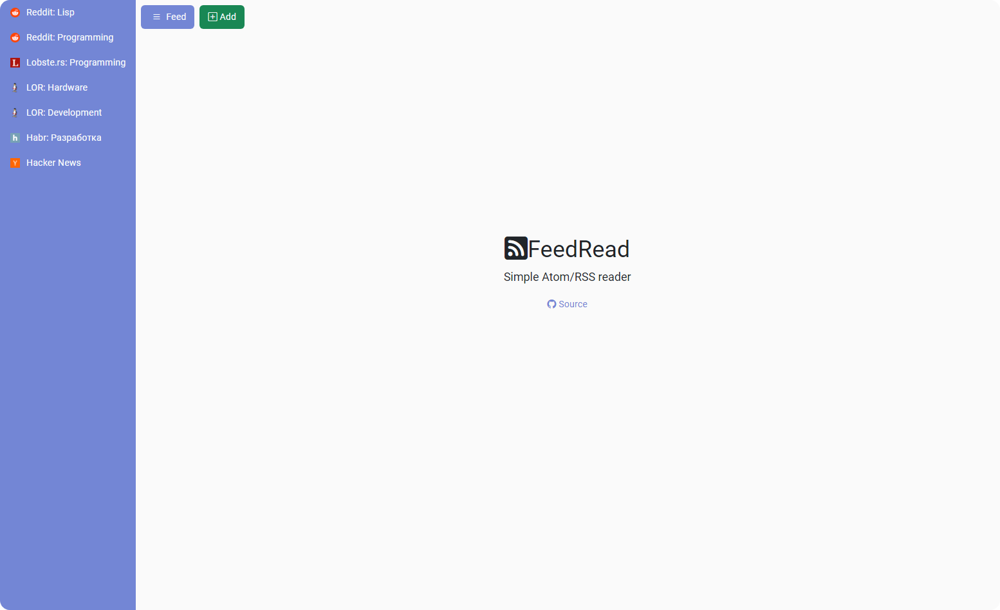

# FeedRead
Simple Atom/RSS reader




## Run 
```sh
# Copy env file
cp .env.local .env

# Change DB_DATABASE in .env

# Install Laravel dependencies
composer install

# Install nodejs dependencies
npm install

# Build assets
npm run build

# Generate key
php artisan key:generate

# Migrate database
php artisan migrate

# Serve
php artisan serve

# Go to http://localhost:8000/
```

## Run in Docker
```sh
# Copy env file
cp .env.docker .env

# Run docker
docker-compose up -d

# Generate key
docker-compose exec app php artisan key:generate

# Migrate database
docker-compose exec app php artisan migrate

# Go to http://localhost:8000/
```
